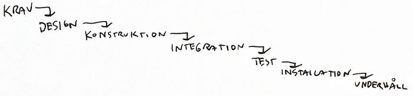

# Agila arbetsmetoder

Att arbeta agilt eller iterativt är mest bara sunt förnuft eller en (bättre) arbetskultur.

Klassiskt har metoder för (mjukvaru)utveckling kommit från utveckling i av andra (fysiska) produkter som t.ex. att bygga en bil eller en bro. En bil designas för att sedan byggas exakt likadana kopior av. Mjukvara behöver oftast inte dupliceras på de sättet utan kan eller behöver istället fortsätta utvecklas under hela livscykeln. Skillnaden mellan mjukvara och hårdvara är stor.

En klassisk utvecklingsmetod är Vattenfallsmetoden. En av grundidéerna är att minimera sena ändringar eftersom det kan kosta väldigt mycket pengar att tex. förändra en hel fabrik sent i processen. Fokus är att bli klar med varje fas innan nästa påbörjas. Utvecklingen sker sekvensielt i ungefär dessa steg:

Ett av de absolut största problemet med att använda en såpass tung eller stelbent process för att bygga mjukvara är att steget från krav färdig produkt blir långt. Ofta vet varken team eller kund vad de vill ha förrän efter produkten är färdig och då är det oftast tungt och dyrt att att ändra.

**En väldigt viktig del i utveckling är att förstå vad det var man behövde bygga. Ofta blir det tydligt för kund, utvecklare och team efter att produkten är byggd :)**

I alla agila metoder vänder man på steken och försöker hela tiden utveckla och leverera nästa fungerande produkt så fort som möjligt. Då behöver man arbeta i korta itterationer där fokus är att bryta ner varje större uppgift till lagom stora steg att visa kunden (som kan vara mer närvarande i alla stegen). I varje steg går det då att känna på produkten och försöka försäkra sig om att man är på väg åt rätt håll. 

Längden på en utvecklingsiteration beror på men ofta från några dagar till några veckor. Det finns troligen lika många olika varianter på agila arbetsmetoder som det finns projekt eller företag. Lär er koncepten.

Läs: 
 * https://en.wikipedia.org/wiki/Agile_software_development 
 * https://en.wikipedia.org/wiki/Waterfall_model

## Kanban

Kanban är en slags agil metod från Japan och blev känd från Toyota. Den sk. Kanban-boarden kommer härifrån likaså Cards. Se denna förklaring av att arbeta iterativt: https://www.youtube.com/watch?v=iVaFVa7HYj4 Även om han pratar om Kanban i videon gäller koncepten. Videon är vald för att den tydligt och enkelt visar hur todos kan hanteras med post-it-lappar.

Scrums (nedan) motsvarighet till *Kanban-tavlan* heter *Sprint backlog*.

## Scrum

Scrum är en av de mest använda agila arbetsmetoden i mjukvaruprojekt. Den bestämmer i större detalj hur arbetet går till.

### Roller i Scrum
**Product owner (PO)** är personen som i första hand ansvarar för att ta fram och prioritera de övergripande förändringar som ska göras i en produkt. Om andra personer (som tex. en utvecklare) vill göra en förändring sker det oftast i samtal med PO. Hen representerar kunderna.

**Scrum master (SM)** är personen som hjälper utvecklingsteamet att arbeta så effektivt som möjligt. Ofta, men inte allid, är SM del av utvecklingsteamet.

**Scrum team** är personerna som arbetar med att utveckla produkten. Ofta en grupp om 5-9 personer.

### Arbetsgången i Scrum (förenklad)

Arbetet sker i *Sprints* vilka är ungefär 2v långa (varierar beroende på projektstorlek). Det första som händer när en sprint startar är att *PO* tillsammans med utvecklarna och *SM* kommer överens om vad som ska göras under nästa sprint. De väljer ut lagom många *Product backlog items* från en *Product backlog* och lägger in på sin *Sprint backlog*. En grov estimering av varje *item* görs när den läggs till *Sprint backlog*. *PO* ansvarar för att hålla uppdaterad och prioritera *Product backlog* med alla de förändringar som behöver göras i produkten.

En *Sprint backlog* liknar ofta en *Kanban-board* och kan gärna göras med post-it-lappar som flyttas i kolumner från vänster till höger.

Efter prioriteringarna kan utvecklarna börja arbeta och meningen är att de under sprinten ska få ganska lugn och ro. Är det ändringar eller omprioriteringar som behöver göras ansvarar *SM* för samtalet med *PO* eller om det är andra saker som behöver fixas.

Arbetet varje dag börjar med ett kort möte (ca 10 min) kallat *Daily scrum* eller *Standup meeting* där alla utvecklare en i taget kan ställa frågor eller uppdatera statusen på sitt arbete och om det finns något nytt problem som dykt upp hanteras det här.

När sprinten är slut har utvecklare, *SM* och *PO* ett möte med en demo och utvärdering (*retrospective*) av arbetet i sprinten. En unik sak med Scrum är att här utvärderas även hur många *items* utvecklarna hann med under sprinten. Finns det *items* kvar betyder det att gruppen tagit på sig för mycket arbete för sprinten och mängden arbete utvecklarna kan ta på sig justeras ner till nästa sprint. Detta kallas i Scrum för *Velocity* men mer om det senare.

### Velocity, poäng, planning poker, definition of done
TBD

Läs: 
 * https://en.wikipedia.org/wiki/Scrum_(software_development) 
 * http://extra.lansstyrelsen.se/tillsynsutvecklingivast/SiteCollectionDocuments/M%C3%A5nadens%20goda%20exempel/Scrum%20p%C3%A5%20fem%20minuter.pdf 

# Uppgifter Agila metoder

Vi utgår från terminologin främst från Scrum. Förklara följande med dina egna ord.

* Vad är en *Sprint*?
* Förklara de olika rollerna i Scrum: *Product owner*, *Scrum master* och *Scrum team*
* Vad är en *Product backlog item* och till vad / varför änvänds de?
* Vad är en *Product backlog* och vad är en *Sprint backlog*?
* Vad menas med *Minimum Viable Product* (eller *Minimum Viable Feature*)?
* Vad menas med *Definition of Done*?
* Förklara med egna ord vad som menas med att arbeta *agilt*. Reflektera och diskutera kring varför jag säger att det är en kultur snarare än metod att arbeta (eller vara) agilt?

# Mål för nästa projekt:
 * Börja förstå vad det innebär att arbeta agilt
 * Skriva *product backlog items* från samtal med *PO* eller användare. 
 * Arbeta aktivt med någon form av *Sprint backlog board eller *Kanban-tavla* för att samarbeta med planering i projektgruppen.
 * Börja ta steg mot att identifiera och bryta ner för stora uppgifter till lagom stora och hanterbara delar.
